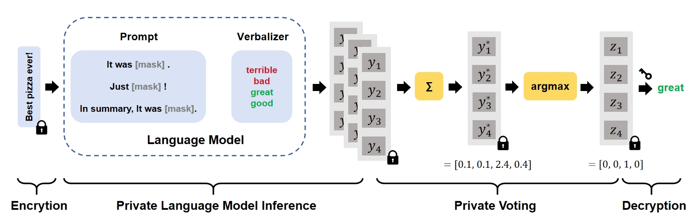

# SecPE
This repository is the implementation of paper: ["SecPE: Secure Prompt Ensembling for Private and Robust Large Language Models (*2024 ECAI*)"](https://www.ecai2024.eu/programme/accepted-papers#main-track).
<br/>
SecPE is the first secure prompt ensembling framework for private and robust LLM inference.




## Run SecPE

#### Step1: Complie SEAL
We use Microsoft SEAL library version 3.6.6 for RNS-CKKS homomorphic encryption scheme. Since SEAL does not support boostrapping, we rely on the boostrapping implementation of [FHE-MP-CNN](https://github.com/snu-ccl/FHE-MP-CNN/tree/main-3.6.6/cnn_ckks/cpu-ckks/single-key/seal-modified-3.6.6).

You should build and install the modified SEAL library in SEAL-3.6-bs/
```bash
cd SEAL-3.6-bs
cmake -S . -B build
cmake --build build
cmake --install build
```


#### Step2: Complie SecPE

```bash
cmake .
make
```

This should produce a binary file `bin/main`.
